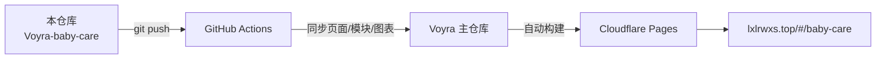

<div align="center">

# 👶 Voyra · 宝宝护理 · Baby Care Tracker

**新生儿喂养/排泄/睡眠全记录，趋势图表与成长提醒 ｜ Newborn feeding, diaper and sleep tracking with growth trends**

[](https://github.com/liixnglinb/Voyra-baby-care/actions/workflows/sync-to-voyra.yml)


### [🌐 在线演示 Live Demo](https://lxlrwxs.top/#/baby-care) ｜ [🏠 Voyra 主站 Main Site](https://lxlrwxs.top) ｜ [📦 主仓库 Main Repo](https://github.com/liixnglinb/Voyra)

</div>

---

## 💡 这是什么 / What Is This

一套面向新手爸妈的**新生儿日常护理记录工具**：喂奶、换尿布、排便、排尿、睡眠一键记录，今日数据汇总到首页，并用趋势图表观察宝宝的作息规律，辅以预测提醒与成长档案。

*A daily newborn-care tracker for new parents: log feeds, diapers, stool, urine and sleep in one tap, review today's totals on the home page, spot routines with trend charts, and keep a growth profile with smart reminders.*

## ✨ 功能特性 / Features

- **九项快捷记录**：喂奶（母乳/配方奶与奶量）、排便、排尿、换尿布、睡眠等，一键打点。
  *Nine quick-record actions: feeds (with volume), stool, urine, diapers, sleep and more.*
- **今日首页**：当天喂奶次数与总量、排便/排尿次数、睡眠时长（含夜间）一目了然。
  *Today dashboard: feed count & volume, stool/urine counts, total and nighttime sleep.*
- **趋势统计图表**：自研轻量趋势图组件，按天/周观察奶量、睡眠等变化曲线。
  *Lightweight custom trend charts to watch daily/weekly curves.*
- **预测提醒**：依据上次记录时间推算下次喂奶/换尿布时点。
  *Predicts the next feed/diaper time from recent records.*
- **历史记录与宝宝档案**：时间线回溯、宝宝信息与妈妈产后护理知识。
  *History timeline, baby profile and postpartum care notes for mom.*
- **云端同步**：登录后数据存入 Bmob 云端，多设备不丢失。
  *Cloud sync via Bmob after sign-in — safe across devices.*

## 🛠 技术栈 / Tech Stack

| 类别 Category | 技术 Stack |
| --- | --- |
| 框架 Framework | React 18（Hooks） |
| 构建 Build | Vite 5 |
| 样式 Styling | Tailwind CSS |
| 图表 Charts | 自研 SVG 趋势图组件（无重型图表库） |
| 数据 Data | Bmob（hydrogen-js-sdk，Voyra 共享层） |
| 图标 Icons | lucide-react |

## 📁 目录结构 / Structure

```
src/
├── pages/
│   ├── BabyCare.jsx          # 护理主页面：今日首页/记录/导航 / Main page
│   └── babycare-modules.jsx  # 各功能模块：档案/历史/提醒/妈妈护理 / Feature modules
└── components/
    └── TrendChart.jsx        # 轻量 SVG 趋势图组件 / SVG trend chart
```

## 🔗 与 Voyra 主仓库的关系 / How It Syncs

本仓库是 Voyra 个人工具中心「宝宝护理」模块的**独立源码仓库**：代码在本仓库维护，每次 `push` 由 GitHub Actions 自动同步到 Voyra 主仓库的相同路径，主仓库统一构建并部署到 Cloudflare Pages。

*Standalone source repo of the Baby Care module. Every push is auto-synced into the main Voyra repository, which builds and deploys the whole site.*



## 🚀 本地开发 / Development

模块依赖主仓库共享层（路由、鉴权、Bmob、通用组件），完整运行请克隆主仓库：

*Depends on the main repo's shared layer (router, auth, Bmob, common UI). Clone the main repo to run locally:*

```bash
git clone https://github.com/liixnglinb/Voyra.git
cd Voyra && npm install && npm run dev
```

## 📄 许可证 / License

MIT © [liixnglinb](https://github.com/liixnglinb)

## 🔍 关键词 / Keywords

宝宝护理 新生儿记录 喂奶记录 育儿日记 换尿布 睡眠记录 婴儿喂养 成长曲线 新手爸妈 ｜ baby care tracker newborn feeding log diaper sleep tracking growth chart react
